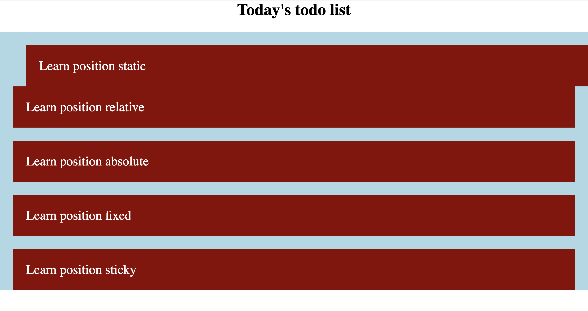
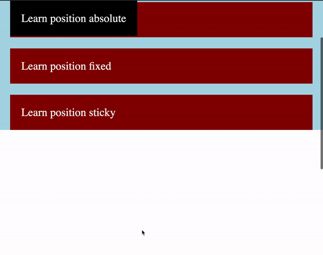

# CSS - Positioning of elements

This repo displays (currently four) the five position styles available to us in css;

```css
 {
  position: static;
  position: relative;
  position: absolute;
  position: fixed;
  position: sticky;
}
```

## Static

By default elements get assigned the position static value, meaning; they follow the standard document order as specified in the HTML document - from top to bottom. There is not much to it other than that.

## Relative

Position relative (relative with respect to itself) looks a lot like position static - accept; we now have 4 extra ways of styling options to our toolkit - namely;

- top
- right
- bottom
- left

This means we can position the element, relative to itself from the regular document flow. Say we have the following html structure;

```html
<!DOCTYPE html>
<html lang="en">
  <head>
    <meta charset="UTF-8" />
    <meta name="viewport" content="width=device-width, initial-scale=1.0" />
    <link rel="stylesheet" href="./style/style.css" />
    <title>css positions</title>
  </head>

  <body>
    <section>
      <h2>Today's todo list</h2>
      <ul>
        <li>Learn position static</li>
        <li>Learn position relative</li>
        <li>Learn position absolute</li>
        <li>Learn position fixed</li>
        <li>Learn position sticky</li>
      </ul>
    </section>
  </body>
</html>
```

And the following css styles;

```css
*,
html {
  padding: 0;
  margin: 0;
  box-sizing: border-box;
}

h2 {
  text-align: center;
  font-size: 2.5em;
}

ul {
  background: lightblue;
}

li {
  background: darkred;
  padding: 1em;
  margin: 1em;
  font-size: 2em;
  color: white;
  list-style-type: none;
}
```

In practise this would give us the following output;


Now if we would add position fixed to the first list item, it would allow us to style this element - relative to itself. So we can now specify the following styles;

```css
ul li:first-child {
  position: relative;
  top: 1em;
  left: 1em;
}
```

Giving us the following result;


As we now see, the element is positioned relative to itself. You should becareful using this setup since it can easily break the document with respect to responsive developement - but that is another topic on it's own. You might ask yourself; "If this is not to be used - then what is position relative good for?"

Well, I'm happy you ask; position relative serves another great cause within css land - namely the cause combined with other position values such as position absolute. Position relative can serve as a relative container for other elements. More about this in the following section; position absolute.

## Absolute

Position absolute completely deletes an element out of the document flow. Meaning; all other elements are being rendered as if the absolute positioned element does not exist. Absolute positioned elements use their parents as their "container" so to say. If there is no parent element - it will use the top html element.

If we look at our html example - we can see that the list items parent is the 'ul' element.
Say we add the following styles to our learn position absolute element;

```css
ul li:nth-child(3) {
  background: black;
  position: absolute;
  top: 0;
  left: 1em;
}
```

This would result in the list item containing the content "Learn position absolute" to be moved to the top of the document - since no parent has a container specified. We can see in the following image how the code responds. We can also see that our margin on the "li" element is still taken into account.


Now if we would set the parent of the "li" equal to a position of relative, what would happen? See for yourself;


Exactly as we thought! It is now styled relative to it's parent using their parent as a container.
That being said, let's move on to the next position (😉 pun intended).

## Fixed

When working with position fixed keep in mind that it is always based on the whole document. It ignores all parent styles and moves itself relative to the document. Besides that, it scrolls along with you - which is pretty cool. Let's add the following styles to demonstrate.

```css
/* we change position to fixed, and set the margin to 0 */
ul li:nth-child(3) {
  background: black;
  position: fixed;
  top: 0;
  margin: 0;
  left: 1em;
}
/* we also add a height to our body of 200 view height in order to demonstrate the scrolling */
body {
  height: 200vh;
}
```

Results into;


